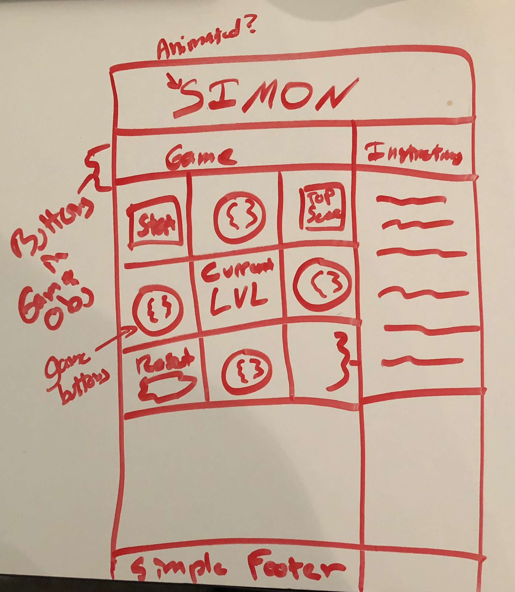

Overview
============
Project one is game of simon says, based on the popular children's toy. The game starts with the player selecting their desired difficulty level and then pressing start. There is a cpu indicator light to let the player know when the computer is chosing the moves they are to repeat. After the cpu light goes off, the player then repeats the pattern to advance to the next level. 

Link to Github Pages deployment: [Here!](https://wsnjie.github.io/simon-game/)

Technologies
==============
- HTML5, CSS3, Javascript, jQuery
- Design: [NES.CSS](https://nostalgic-css.github.io/NES.css/) which was made using [Bulma](https://bulma.io/documentation/overview/start/), SweetAlert
- [Trello](https://trello.com/b/oNRqbXzW/project-1) for planing and stories
- [Soundjay](https://www.soundjay.com/button-sounds-1.html) for audio files for buttons.

Features
===========
* Three difficulty levels
  *Easy: More time between each computer move to give the user more time to memorize the moves. User wins after level 10.
  * Fun: The baseline of about 1 second per move for 10 levels.
  * Tough: Just over half a second between moves and the user can play up to level 100, if they want.

* CPU Indicator Light
  * Lets the user know then the computer is playing versus when it is their turn to repeat the sequence
  *Input is locked during CPU playback, so the indicator is there to help remind the user not to try and enter moves.

* High Score
  * High score is saved after an incorrect move is entered by the user
  * On Easy and Fun modes, maximum high-score is 10. On Tough mode, maximum is 100.

Wireframe
=============

This particular whiteboard was very rudimentary, but the basic design and functionalty remained the same throughout the project and this drawing did inform the design of the game.

Future Devlopment
============
* Clean up page responsiveness
* Smoother animations for play moves
* More exciting animation for a win
* Ability to share high score on social media